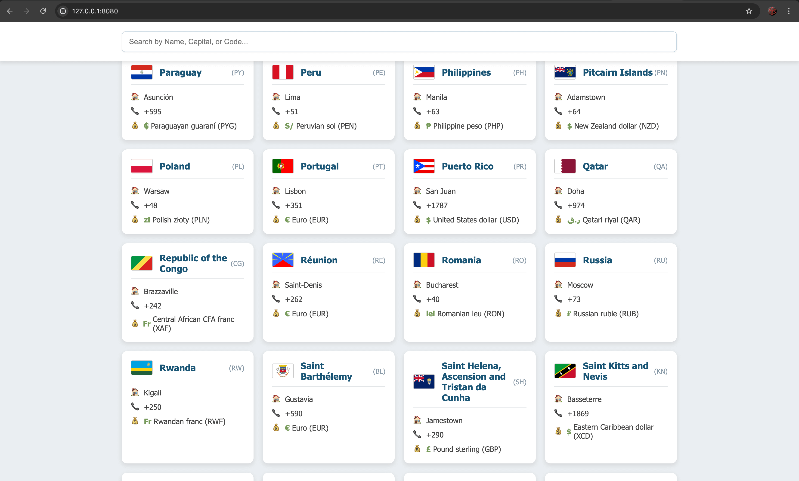
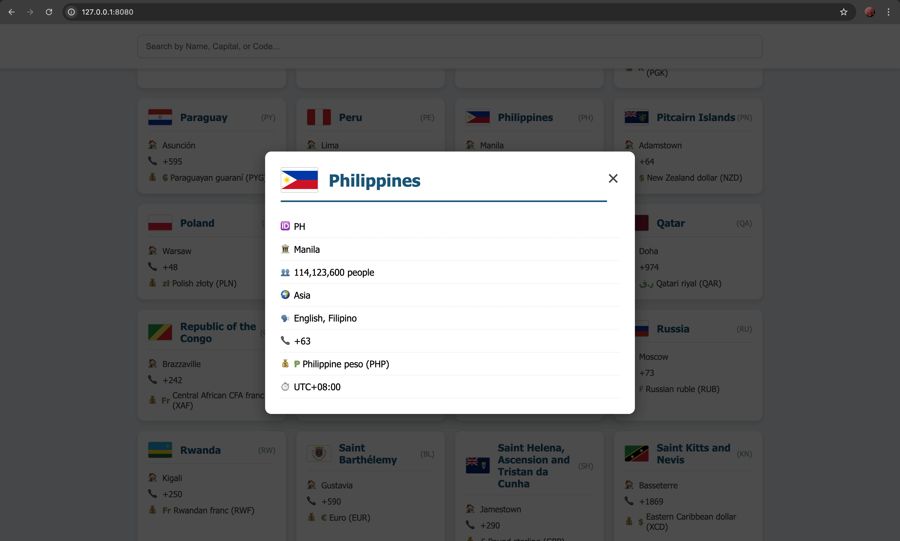

# 🌍 Country Data Explorer (Vanilla JS)

  
  

A simple, responsive web application built using **Vanilla HTML, CSS, and JavaScript** to fetch, display, and filter comprehensive data for all countries worldwide.

This project is highly optimized for performance and responsive design, featuring sticky search bar functionality and a perfectly centered modal for detailed views.

---

## ✨ Features

- **Real-time Search:** Instantly filter the list of countries by **Name, Capital, or Country Code (CCA2)**.
- **Responsive Card View:** Displays country data in an adaptive grid layout, offering key information (Capital, Phone Prefix, Currency) at a glance.
- **Centered Detail Modal:** Clicking a card opens a detailed popup (modal) that is **flex-centered** for perfect positioning on all screen sizes, including mobile.
- **External API Integration:** Data is fetched from the reliable **REST Countries API** to ensure up-to-date information.
- **Clean Design:** Features a modern, easy-to-read UI with a sticky header.

---

## 🚀 Setup & Usage

Since this project uses a remote API call (`fetch()`), you must run the file using a local web server to bypass browser security restrictions (CORS/File Protocol).

### 1. Prerequisites

- A web browser (Chrome, Firefox, Edge, etc.).
- A method to run a local server (e.g., VS Code's **Live Server** extension, Python's `http.server`, or similar).

### 2. Installation Steps

1.  Save the provided code as an `index.html` file.
2.  (Optional but Recommended) Ensure you have a local server running.
3.  Open the `index.html` file through your local server.
4.  The application will automatically fetch and display the country data.

### 3. Interacting with the App

1.  **Search:** Use the input field at the top to filter the results.
2.  **View Details:** Click any country card to open the modal and see details like Population, Languages, Timezones, and official names.
3.  **Close Modal:** Click the `&times;` button or click outside the modal overlay.

---

## 🛠️ Technology Stack

| Component             | Description                                                                                                         |
| :-------------------- | :------------------------------------------------------------------------------------------------------------------ |
| **Frontend**          | Pure HTML, CSS, and Vanilla JavaScript (ES6+).                                                                      |
| **Styling**           | Utilizes **CSS Grid** for the main card layout and **CSS Flexbox** for navigation and the perfectly centered modal. |
| **Data Source**       | REST Countries API (`https://restcountries.com/v3.1/all`).                                                          |
| **Key Functionality** | Asynchronous `fetch` calls, dynamic DOM manipulation, and efficient filtering logic.                                |

### Data Endpoint Used

The application requests a minimal set of fields for efficiency:
/all?fields=name,flags,capital,idd,currencies,cca2,population,region,languages,timezones

---

## 🎨 Design and Responsiveness

The application is styled using a modern, accessible color palette:

| Element             | Color Code | Description                                    |
| :------------------ | :--------- | :--------------------------------------------- |
| **Primary Accent**  | `#175676`  | Deep Blue (Used for Headers and Primary Text). |
| **Background**      | `#EBEFF2`  | Soft Gray (Page Background).                   |
| **Currency Symbol** | `#779B5D`  | Soft Green (Highlighting currency symbols).    |

The layout is fully **responsive**, adjusting the grid columns and modal content size to ensure excellent usability on screens ranging from small smartphones up to large desktops.

---

## 🤝 Contributing

This project is a great example of a simple, modern frontend application. Feel free to fork the repository, open issues for bugs, or submit pull requests for enhancements!
